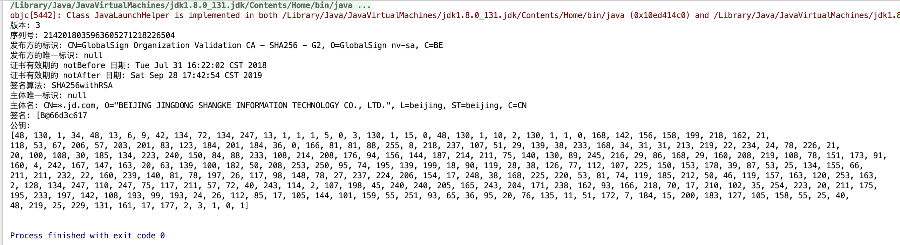
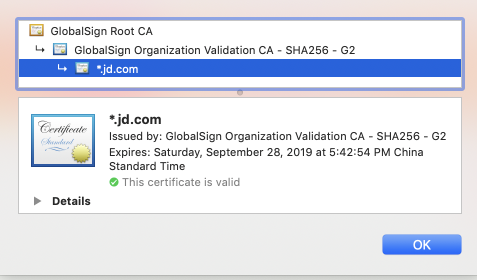

# Assignment 3

16340028 陈思航

## 题目

设计并实现一个小程序，读入一个X.509数字证书，按照标准定义给出证书中有关项目的中 (英) 文内容陈述。

## X.509 

X.509作为密码学中的公钥证书的标准格式，可以应用在`TLS/SSL`等众多互联网的协议中。以下的X.509证书中内容的定义摘抄自维基百科。

> X.509证书里含有公钥、身份信息（比如网络主机名，组织的名称或个体名称等）和签名信息（可以是证书签发机构CA的签名，也可以是自签名）。对于一份经由可信的证书签发机构签名或者可以通过其它方式验证的证书，证书的拥有者就可以用证书及相应的私钥来创建安全的通信，对文档进行数字签名。

X.509证书的结构是用ASN.1(Abstract Syntax Notation One)进行描述数据结构，并使用ASN.1语法进行编码。

同时，它由CA颁发证书并与X.500传统中的可分辨名称比如email地址或者DNS中的项绑定。而对于浏览器，它们事先安装了根证书(Root Certificate)，大型供应商的SSL证书可以立即生效。

### 证书的组成

X.509证书的结构如下：

- 版本号 Version。
  - Version 1(1988): 发布并与与X.500关联。
  - Version 2：包括主体和发布者的标识符。
  - Version 3(1996): 也称为PKIX，作为公钥架构。
- 序列号 Serial Number，作为CA分配给本证书的唯一标识符。
- 签名算法 Algorithm ID，作为本证书所用数字签名算法的说明，由对象标识符与相关参数组成。
- 颁发者 Issuer (CA’s name)，CA的可识别的名字。
- 证书的有效期 Validity
  - 在此日期前无效 Not Before
  - 在此日期后无效 Not After
- 主体 Subject，本证书拥有者的可识别名
- 主体公钥信息 Subject Public Key Info
  - 公钥算法 Public Key Algorithm
  - 主体公钥 Subject Public Key
- 颁发者唯一身份信息 Issuer Unique Identifier（可选），作为CA的唯一标识符
- 主体唯一身份信息 Subject Unique Identifier（可选），作为本证书拥有者的唯一标识符。
- 扩展信息 Extensions（可选）。
- 证书签名算法 Certificate Signature Algorithm。
- 数字签名 Certificate Signature。

### X.509的安全性
#### X.509的证书吊销(Revoke a certificate)
##### 证书的吊销

如果出现以下的情况该证书会被吊销：

- 证书不在有效期内。
- 客户端不信任CA。
- CA认为该证书不安全。

##### CRL (Certificate Revocation List)

CRL，即证书吊销列表。对证书进行合法性检查，如果不在有效期内，该证书会被吊销。这是因为客户端仅信任在CRL可用时信任证书。

#### X.509的问题

X.509存在如下的问题：

过于复杂。通信双方需要分别获得公钥才能利用公钥和自己的私钥对通信的信息进行解密和加密。

结构缺陷。证书的链使得CA的下属同时也是颁发机构，数量繁多、结构复杂。机构之间的交叉认证使得验证变得非常复杂，而且CA无法限制下属颁发的证书名字和属性。

## 程序实现

这次不用C++实现X.509内容的解析。这是因为C++对证书内容的解析极其不方便，无论是文件的读取还是之后信息的提取。而且对于Java，通过`CertificateFactory`就可以将`FileStream`类读取的`.cer`文件进行操作，而且可以调用类中的函数直接就可以返回证书中对应的内容。作业要求没有限定只能用C，时间有限任务重，还要期末复习。同样能够达到了解证书结构的学习目的，当然选择友好得多的Java了。

### 文件的读取

这里通过`FileIO`类进行文件的读取，通过调用`FileInputStream`类通过文件路径进行读取，再通过调用证书工厂`CertificateFactory`类返回实例化的证书，再将其转换为X.509证书类`X509Certificate`。	

其中，`CertificateFactory`类包括`CertPath`以及`CRL`的功能实现，同时也包含了生成证书的功能。

```Java
// 读取证书
            FileInputStream fs = new FileInputStream(filePath);
            CertificateFactory cf = CertificateFactory.getInstance("X.509");
            Certificate cer = cf.generateCertificate(fs);
            // 将证书转换为X509证书
            this.x = (X509Certificate)cer;
            fs.close();
```

### 证书的内容

Java中的类`X509Certificate`非常方便。这是X.509的抽象类，可以访问证书属性。

其中的函数和对应的功能如下（参考：http://jszx-jxpt.cuit.edu.cn/JavaAPI/java/security/cert/X509Certificate.html）

| 函数                       | 功能                                     | 结果                                                    |
| -------------------------- | ---------------------------------------- | ------------------------------------------------------- |
| checkValidity              | 通过检查证书是否在有效期内从而检查合法性 | 如果抛出异常则证书不再有效                              |
| getVersion                 | 获得证书的版本                           | 版本号1、2、3                                           |
| getSerialNumber            | 获得证书的序列号，即唯一的标识号         | 序列号                                                  |
| getIssuerX500Principal     | CA的标识                                 | 发布方的标识名，可转为String                            |
| getIssuerUniqueID          | CA的唯一标识(可选)                       | 发布方的惟一标识符，如果证书中没有该标识符，则返回 null |
| getNotBefore / getNotAfter | 证书的有效期                             | 有效期的起始日期 / 终止日期                             |
| getSigAlgName              | 证书的签名算法                           | 签名算法名                                              |
| getSubjectUniqueID         | 获得主体的唯一标识(可选)                 | 主体惟一标识符，如果证书中没有该标识符，则返回 null     |
| getSubjectX500Principal    | 主体的名称                               | 主体名，可转为String                                    |
| getSignature               | 获得主体的签名                           | 签名                                                    |
| getPublicKey               | 获得证书的公钥                           | 公钥                                                    |

函数的实现如下：

```java
String filePath = "sample/jd.cer";
            FileIO fio = new FileIO(filePath);
            // 检查合法性
            fio.getX().checkValidity();
            // 获得版本号
            System.out.println("版本: " + fio.getX().getVersion());
            // 获得序列号
            System.out.println("序列号: " + fio.getX().getSerialNumber());
            // 证书发布方的值
            System.out.println("发布方的标识: " + fio.getX().getIssuerX500Principal().toString());
            System.out.println("发布方的唯一标识: " + fio.getX().getIssuerUniqueID());
            //证书有效期
            System.out.println("证书有效期的 notBefore 日期: "+ fio.getX().getNotBefore());
            System.out.println("证书有效期的 notAfter 日期: "+ fio.getX().getNotAfter());
            //证书的签名
            System.out.println("签名算法: "+ fio.getX().getSigAlgName());
            System.out.println("主体唯一标识: "+ fio.getX().getSubjectUniqueID());
            //主体
            System.out.println("主体名: "+ fio.getX().getSubjectX500Principal());
            //主体的签名
            System.out.println("签名: "+ fio.getX().getSignature().toString());
            // 从此证书中获得公钥
            byte [] encode = fio.getX().getPublicKey().getEncoded();
            System.out.println("公钥:");
            String key = "[";
            for(int i = 0 ; i < encode.length ; i++)
            {
                int index = encode[i] & 0xff;
                key += Integer.toHexString(index);
                if(i < encode.length - 1) key += ", ";
                if(i % 40 == 0 && i != 0){
                    key += "\n";
                }
            }
            System.out.println(key + "]\n");
```

### 实验结果

实验结果如下（因为是中文说明所以就不在赘述所有的内容）。



该证书为[京东](https://www.jd.com)的X.509数字证书。

